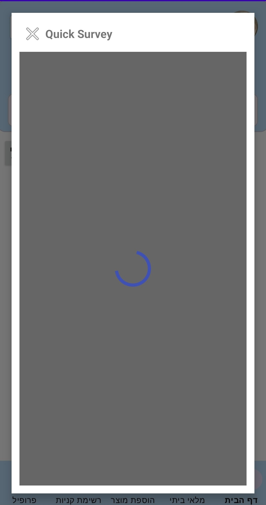
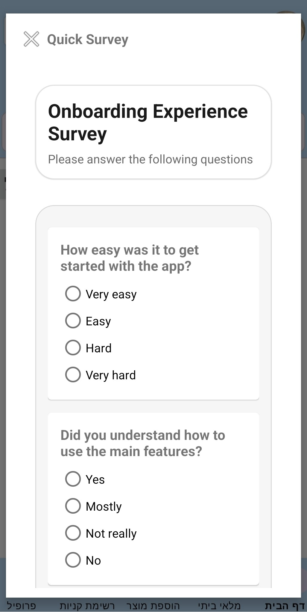

# 📋 Smart Survey SDK

---
Smart Survey SDK is an Android library that allows developers to display surveys inside their apps.
The SDK can load a survey from a server (by ID or randomly), render it as a UI component, and submit the user's answers back to the server.

This library is designed to be simple to integrate and easy to use inside any Android project.

---
## ✨ Features

- ✅ Easy SDK initialization using `SmartSurvey.init(...)`
- ✅ Load surveys by ID 
- ✅ Load random surveys
- ✅ Supports multiple question types:
    - Text input
    - Single choice (radio buttons)
- ✅ Automatic submission to the server
- ✅ Callback listener for events
---

## 📦 Installation

### Step 1 - Add JitPack repository

In your project root `settings.gradle.kts`, add JitPack:

```kotlin
dependencyResolutionManagement {
    repositoriesMode.set(RepositoriesMode.FAIL_ON_PROJECT_REPOS)
    repositories {
        google()
        mavenCentral()
        maven("https://jitpack.io")
    }
}
```

### Step 2 - Add the dependency

In your app module `build.gradle.kts`, add:

```kotlin
dependencies {
    implementation("com.github.Tomerlevy104:smart-survey-sdk:v1.0.1")
}
```

Sync Gradle and wait for the dependency to download.

---

## 🚀 Usage

### 1. Initialize the SDK

You must initialize the SDK once before using it.
The recommended place is `Application.onCreate()` or inside your first Activity.

```kotlin
SmartSurvey.init(
    context = applicationContext,
    baseUrl = "https://survey-sdk-server.onrender.com/",
    apiKey = "YOUR_API_KEY"
)
```
> 🔑 **API Key:** You can get your API key from the Admin Panel after creating an account.

---

### 2. Create the `SmartSurveyView`

You can create the survey view in two different ways:

#### Option A: Add the view in XML (static)

Add `SmartSurveyView` directly to your layout:

```xml
<com.seminar.smart_survey_sdk.SmartSurveyView
    android:id="@+id/smartSurveyView"
    android:layout_width="match_parent"
    android:layout_height="wrap_content" />
```

Then use it in your Activity/Fragment:

```kotlin
val smartSurveyView = findViewById<SmartSurveyView>(R.id.smartSurveyView)
smartSurveyView.setListener(...)
smartSurveyView.loadRandomSurvey()
```

---

#### Option B: Create the view in Kotlin (dynamic / overlay)

This option is useful for overlays, popups, dialogs, or if you want to add/remove the survey dynamically:

```kotlin
val smartSurveyView = SmartSurveyView(this).apply {
    setListener(...)
}

surveyContainer.addView(
    smartSurveyView,
    FrameLayout.LayoutParams(
        FrameLayout.LayoutParams.MATCH_PARENT,
        FrameLayout.LayoutParams.MATCH_PARENT
    )
)

smartSurveyView.loadRandomSurvey()
```

> Both approaches are supported because `SmartSurveyView` provides constructors for XML inflation and programmatic creation.

---

### 3. Load a survey

#### Option A: Load survey by ID

```kotlin
smartSurveyView.loadSurveyById("YOUR_SURVEY_ID")
```

#### Option B: Load a random survey

```kotlin
smartSurveyView.loadRandomSurvey()
```

---

### 4. Listen to survey events

You can register a listener to get callbacks:

```kotlin
smartSurveyView.setListener(object : SmartSurveyListener {

    override fun onSurveyLoaded(surveyId: String) {
        // Survey UI was loaded successfully
    }

    override fun onSurveySubmitted(surveyId: String) {
        // Survey answers were submitted successfully
    }

    override fun onError(error: Throwable) {
        // Any error during loading or submitting
        error.printStackTrace()
    }
})
```

---

### 5. Full example (Activity)

```kotlin
class MainActivity : AppCompatActivity() {

    private lateinit var smartSurveyView: SmartSurveyView

    override fun onCreate(savedInstanceState: Bundle?) {
        super.onCreate(savedInstanceState)
        setContentView(R.layout.activity_main)

        // 1) Init SDK
        SmartSurvey.init(
            context = applicationContext,
            baseUrl = "https://survey-sdk-server.onrender.com/",
            apiKey = "YOUR_API_KEY"
        )

        // 2) Find view
        smartSurveyView = findViewById(R.id.smartSurveyView)

        // 3) Listener
        smartSurveyView.setListener(object : SmartSurveyListener {
            override fun onSurveyLoaded(surveyId: String) {
                Toast.makeText(this@MainActivity, "Survey loaded: $surveyId", Toast.LENGTH_SHORT).show()
            }

            override fun onSurveySubmitted(surveyId: String) {
                Toast.makeText(this@MainActivity, "Survey submitted!", Toast.LENGTH_SHORT).show()
            }

            override fun onError(error: Throwable) {
                Toast.makeText(this@MainActivity, "Error: ${error.message}", Toast.LENGTH_SHORT).show()
            }
        })

        // 4) Load survey
        smartSurveyView.loadRandomSurvey()
    }
}
```

---

## 🖼️ Screenshots

### Open Survey Button (Host App UI)


### Survey Loading State (Overlay + Spinner)


### Survey Screen (Questions & Answers UI)



---
## 🛠️ Technology

This SDK was built using:

- **Kotlin**
- **Material Design Components**
- **Retrofit** (API requests)
- **OkHttp** (HTTP client + Interceptor)

---

## 📌 Public API Summary

The main public API for SDK users:

- `SmartSurvey.init(context, baseUrl, apiKey)`
- `SmartSurveyView.setListener(listener)`
- `SmartSurveyView.loadSurveyById(surveyId)`
- `SmartSurveyView.loadRandomSurvey()`

---

## 👨‍💻 Author

Developed by **Tomer Levy**
