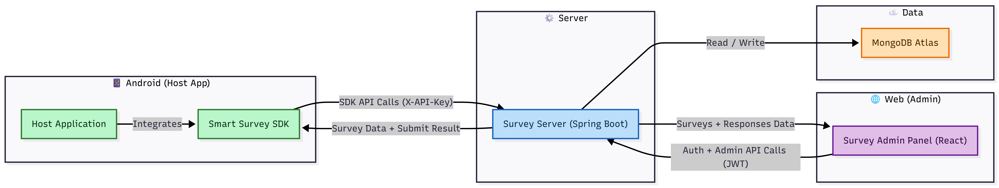

# Smart Survey Documentation

Welcome! This documentation contains everything you need to use the Smart Survey SDK.

## 🏗️ Architecture

> The diagram above shows the complete flow between the Admin Panel, Android SDK, Backend Server, and MongoDB Atlas.

## 📦 Components

- **Library (Android SDK)**: Display surveys inside Android apps, fetch surveys, and submit responses.  
  Repo: [smart-survey-sdk](https://github.com/Tomerlevy104/smart-survey-sdk)

- **Admin Panel (Web)**: Create/manage surveys, view responses, and get your API key after signup.  
  Repo: [survey-admin-panel](https://github.com/Tomerlevy104/survey-admin-panel)

- **Server (Backend)**: Spring Boot API with JWT (Admin) + API Key auth (SDK), MongoDB Atlas storage.  
  Repo: [survey-sdk-server](https://github.com/Tomerlevy104/survey-sdk-server)
